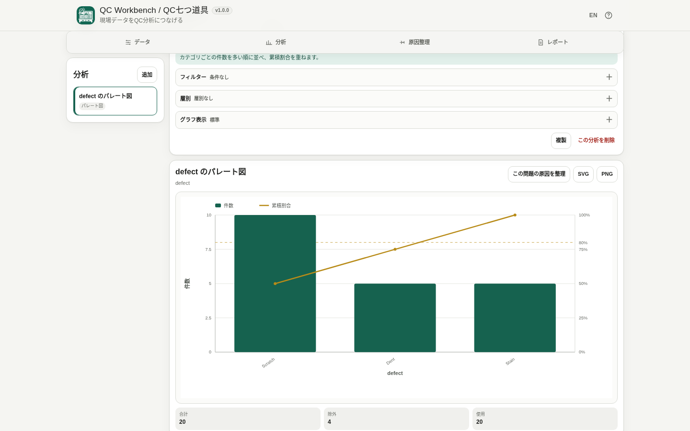

# QC Workbench / QC七つ道具

[](https://github.com/ttomohisa/htmlapps-qc-workbench/actions/workflows/deploy-pages.yml)
[](LICENSE)
[](https://ttomohisa.github.io/htmlapps-qc-workbench/)

[English README](README.md)

CSV / TSVなどの品質管理データを読み込み、パレート図・ヒストグラム・散布図・各種管理図で分析し、特性要因図で原因を整理できるブラウザ完結のQCワークスペースです。読み込んだデータを分析のために外部サーバーへ送信しません。

## 🚀 デモ

### [GitHub PagesでQC Workbenchを開く](https://ttomohisa.github.io/htmlapps-qc-workbench/)

GitHub Pagesから最初のHTMLを読み込んだ後、ファイル解析・列型判定・グラフ計算・プロジェクト保存・特性要因図編集・レポート生成は端末内で処理されます。選択したCSV / TSVの内容がアプリからサーバーへアップロードされることはありません。

[](https://ttomohisa.github.io/htmlapps-qc-workbench/)

## 主な機能

- **1つのデータを複数のQC手法で横断分析** — 一度読み込んだデータから、パレート図・ヒストグラム・グラフ・散布図・管理図を作成できます。
- **工程データ向けの管理図** — I-MR / X̄-R / p / np / c / u 管理図に対応し、管理限界をブラウザ内で計算します。
- **元データを変更しないフィルターと層別** — 分析ごとに条件を持たせ、カテゴリ別の比較もできます。
- **特性要因図で原因を整理** — 4M / 5M1E / 空白から開始し、原因を3階層まで編集できます。
- **作業を保存して再開** — データ・列型設定・分析・フィルター・層別・レポート選択・特性要因図を `.qcw.json` にまとめて保存できます。
- **単一HTMLレポートを作成** — 選択した分析と特性要因図を静的なHTMLレポートとして保存できます。元データCSVは既定では含めず、明示的に選んだ場合だけ埋め込みます。
- **グラフをSVG / PNGで保存** — ラベル、グリッド線、軸タイトル、凡例、データラベルを調整して保存できます。
- **完全ローカル処理の単一HTML** — v1.0.0では外部ランタイムライブラリを使用せず、日本語 / 英語UIを含み、CSPで実行時の外部接続を禁止しています。

## すぐに使う

### Webで使う

[デモを開く](https://ttomohisa.github.io/htmlapps-qc-workbench/)だけで利用できます。インストールやアカウント登録は不要です。

すぐに操作を確認したい場合は **サンプルデータ** を使ってください。日時、サブグループ、不良品数、サンプル数、欠点数の列を含んでいるため、通常のグラフに加えて X̄-R / p / np / c / u 管理図まで別ファイルなしで試せます。

### ダウンロードして使う

1. このリポジトリをダウンロードまたはクローンします。
2. `dist/index.html` を最新のChromiumベースのブラウザ、Firefox、Safariで開きます。
3. `file://` で直接開けるため、ローカルWebサーバーは不要です。

### Windowsで単一HTMLをビルドする

1. このリポジトリをダウンロードまたはクローンします。
2. `build-standalone.bat` をダブルクリックするか、PowerShellで `./build-standalone.ps1` を実行します。
3. `dist/index.html` と `dist/index.self-extract.html` が生成・検証されます。
4. 生成されたHTMLを任意の場所へコピーして利用します。

現在のアプリには外部ランタイム依存がないため、標準構成ではライブラリパッケージの取得はありません。製品ビルドにPython、Node.js、ローカルWebサーバーは不要です。ビルダーはPowerShellとテンプレートのツールチェーンで使用するWindows標準の `tar.exe` を利用します。

## 使い方

1. CSV / TSV / テキストファイルを開く、表計算ソフトからコピーした表を貼り付ける、または内蔵サンプルを読み込みます。
2. 自動判定された列を確認します。用途と異なる場合は、数値・日時・カテゴリ・テキストを手動で変更します。
3. **分析** から目的に合う手法を選び、必要な列を指定します。
4. 必要に応じてフィルターや層別を追加します。**グラフ表示**ではグリッド線、軸タイトル、凡例、ラベル列、データラベルを調整できます。
5. **原因整理** では特性要因図を作成します。パレート図の項目をそのまま「特性」として新しい特性要因図へ渡すこともできます。
6. **レポート** から `.qcw.json` で作業を保存するか、選択した分析・特性要因図を単一HTMLレポートへ書き出します。

### 対応する分析

| 分析 | 必要なデータ | 補足 |
| --- | --- | --- |
| パレート図 | カテゴリまたはテキスト列 | 件数順に並べ、累積割合を重ねます。 |
| ヒストグラム | 数値列 | 自動階級はFreedman-Diaconisを基本に、必要時はSturgesへフォールバックします。 |
| グラフ | 数値Y、任意の数値/日時X | 日時列があれば新規分析時のX軸初期値に使います。行順も選択できます。 |
| 散布図 | 2つの数値列 | Pearson相関係数と回帰直線を表示できます。相関だけでは因果関係は判断できません。 |
| I-MR管理図 | 個別の数値測定値 | 元データの行順を使い、有効な測定値が3件以上必要です。 |
| X̄-R管理図 | 数値測定値 + サブグループ列 | サブグループサイズ2〜10、かつ一定である必要があります。 |
| p管理図 | 不良品数 + サンプル数 | サブグループごとにサンプル数が変わっても利用できます。 |
| np管理図 | 不良品数 + サンプル数 | サンプル数が一定である必要があります。 |
| c管理図 | 欠点数 | 一定の検査単位・検査機会を想定します。 |
| u管理図 | 欠点数 + サンプル数 | 検査量が変わる場合の単位あたり欠点数を扱います。 |

### フィルターと層別

フィルターは分析ごとに保持され、共通の元データ自体は変更しません。数値・カテゴリ・日時・テキストの条件に対応しています。

層別は1つのカテゴリ列を使います。管理図を層別した場合は、異なる管理限界を1枚へ重ねず、層ごとに別の管理図を作り、それぞれのCL / UCL / LCLを個別に計算します。

### 特性要因図

以下から開始できます。

- **4M** — 人 / 設備 / 方法 / 材料
- **5M1E** — 人 / 設備 / 方法 / 材料 / 測定 / 環境
- **空白** — 独自カテゴリから開始

原因は3階層まで整理できます。原因候補をAIなどで自動生成する機能はありません。

### プロジェクト保存と復旧

**プロジェクトを保存**すると、現在のデータと分析状態を `.qcw.json` として保存します。あとで **プロジェクトを開く** から再開できます。

対応ブラウザではIndexedDBにも復旧用スナップショットを保存します。次回起動時に勝手に復元せず、**前回の作業を再開**を表示します。ブラウザ保存領域は削除される可能性があるため、残したい作業は `.qcw.json` を正式なバックアップとして保存してください。

### HTMLレポート

レポートに含める分析と特性要因図を個別に選べます。グラフはSVGとしてHTML内へ埋め込まれるため、生成後のレポート表示に外部ライブラリや通信は必要ありません。

元データCSVは**既定では含みません**。**元データCSVを含める**をONにした場合だけ、ブラウザ内でCSVをレポートへ埋め込みます。

## GitHub Pagesで公開する

このリポジトリには、単一HTMLをビルドして `dist/` をGitHub Pagesへ自動公開するワークフローが含まれています。

1. リポジトリ名を `htmlapps-qc-workbench` としてGitHubへプッシュします。
2. **Settings → Pages → Build and deployment → Source** で **GitHub Actions** を選択します。
3. `main` へプッシュするか、Actions画面から **Deploy standalone app to GitHub Pages** を手動実行します。
4. ビルド成功後、`https://ttomohisa.github.io/htmlapps-qc-workbench/` で公開されます。

`main` へのプッシュ時にはリポジトリ検証、単一HTML生成、成果物検証を行い、GitHub Pagesが有効な場合に `dist/` を公開します。

## 開発とビルド

```text
.
├─ src/index.template.html       # 編集対象のアプリテンプレート
├─ src/qc-core.js                # データ処理・QC計算コア
├─ tests/                        # 計算・UI契約テスト
├─ app.config.json               # アプリ名、版数、ビルド設定
├─ dependencies.json             # 内包ランタイム依存の宣言
├─ build-standalone.bat          # Windows用ビルド入口
├─ build-standalone.ps1          # 単一HTMLビルダー
├─ scripts/                      # リポジトリ / self-extract検証
├─ dist/index.html               # 生成済み単一HTML
├─ dist/index.self-extract.html  # gzip自己展開版
└─ .github/workflows/
   ├─ build-standalone.yml       # Pull Request時のビルド検証
   └─ deploy-pages.yml           # mainからPagesへ自動公開
```

### ビルド検証

リポジトリの検証では主に以下を確認します。

- PowerShellの構文と文字コード
- テンプレートに必要なマーカーとアプリ設定
- faviconとヘッダー左上アイコンの一致
- 未置換プレースホルダー
- 単一HTMLの構造と外部通信ポリシー
- self-extractのペイロード整合性

計算ロジックとUI契約のテストは以下で実行できます。

```bash
npm test
```

## プライバシーと通信防止

生成される単一HTMLには `connect-src 'none'` を含むContent Security Policyがあります。v1.0.0では実行時に利用する外部サードパーティライブラリはなく、読み込んだデータを分析するためのAPI通信も行いません。

GitHub Pages版では最初のHTMLを取得する通常の通信は発生します。そのHTMLを読み込んだ後は、CSV / TSV、貼り付けた表、プロジェクト状態、グラフ計算、特性要因図、生成レポートは端末内で扱われます。

復旧用データはブラウザのIndexedDBへ保存します。プロジェクト、グラフ画像、レポートはブラウザのダウンロードとして保存されます。

完全にネットワークを切って利用する場合は、生成済みの `dist/index.html` をローカルで直接開いてください。

## 制限事項

- Excel `.xlsx` は直接読み込めません。セル範囲をコピーして貼り付けるか、CSV / TSVとして保存してから読み込んでください。
- 列型の自動判定は推定です。分析に使う前に確認し、必要なら手動で変更してください。
- X̄-Rはサブグループサイズ2〜10かつ一定、np管理図はサンプル数一定、c管理図は一定の検査単位・検査機会を前提とします。
- 管理限界は観測された工程データから求めるもので、製品の規格限界とは別です。
- Cp/Cpk、Pp/Ppk、CUSUM、EWMA、Gage R&R、DOE、ANOVAなどの高度な統計手法はv1.0.0には含まれていません。
- ブラウザのメモリ上限は受けます。非常に大きなデータ、多数の層別グループ、多数の描画点はメモリや描画時間を多く使用します。
- 大量データでデータラベルをONにした場合、読みやすさと描画負荷のため文字ラベルだけを間引きます。統計計算には有効データ全件を使用します。
- IndexedDBの復旧データは一時的な補助です。長期保存が必要な作業は `.qcw.json` を保存してください。
- HTMLレポートは出力時点の静的なスナップショットで、QC Workbenchの編集UIそのものを再現するものではありません。

## 使用ライブラリ

QC Workbench v1.0.0には、**実行時に内包するサードパーティライブラリはありません**。標準のWeb APIとシステムフォントを直接使用しています。

リポジトリ内の通知と、将来依存ライブラリを追加する場合の方針は [THIRD_PARTY_NOTICES.md](THIRD_PARTY_NOTICES.md) を確認してください。

## コントリビューション

バグ報告や機能提案はGitHub Issuesからお願いします。開発への参加方法は [CONTRIBUTING.md](CONTRIBUTING.md) を確認してください。

## ライセンス

Copyright © 2026 ttomohisa

このプロジェクトは [MIT License](LICENSE) で公開されています。
