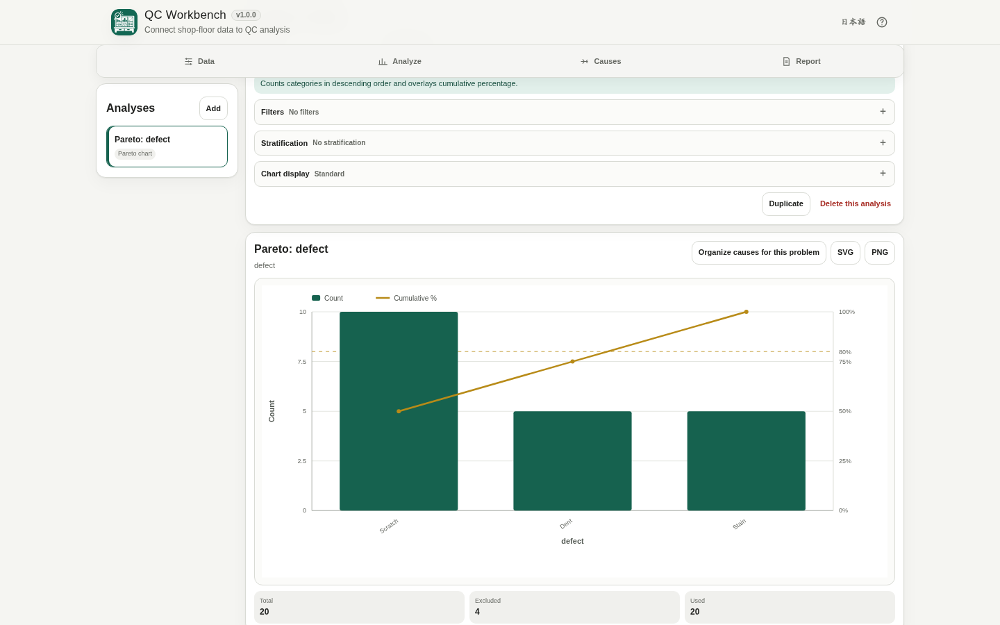

# QC Workbench

[](https://github.com/ttomohisa/htmlapps-qc-workbench/actions/workflows/deploy-pages.yml)
[](LICENSE)
[](https://ttomohisa.github.io/htmlapps-qc-workbench/)

[日本語版 README](README.ja.md)

A browser-only QC workspace for loading CSV / TSV data, building common QC charts and control charts, organizing possible causes with fishbone diagrams, and exporting project files or standalone HTML reports without uploading the imported data to a server.

## 🚀 Live demo

### [Open QC Workbench on GitHub Pages](https://ttomohisa.github.io/htmlapps-qc-workbench/)

GitHub Pages delivers the initial HTML. After it loads, file parsing, type detection, chart calculation, project saving, fishbone editing, and report generation are processed locally on your device. The CSV / TSV data you select is not uploaded by the app.

[](https://ttomohisa.github.io/htmlapps-qc-workbench/)

## Features

- **Reuse one dataset across QC analyses** — Import once, then build Pareto charts, histograms, trend charts, scatter plots, and control charts from the same local dataset.
- **Control charts for common process data** — Create I-MR, X̄-R, p, np, c, and u charts with control limits calculated in the browser.
- **Filter and stratify without changing the source data** — Apply analysis-specific filters and compare category groups while keeping the imported dataset intact.
- **Organize possible causes with fishbone diagrams** — Start from 4M, 5M1E, or a blank structure and edit causes up to three levels deep.
- **Save work and continue later** — Export a `.qcw.json` project containing the dataset, column settings, analyses, filters, stratification, report selections, and fishbone diagrams.
- **Create shareable report files** — Export selected analyses and fishbone diagrams as a standalone HTML report. Source CSV data is excluded by default and can be embedded only when explicitly enabled.
- **Export charts as SVG or PNG** — Configure labels, gridlines, axis titles, legends, and data labels before saving a chart.
- **Private, single-HTML operation** — No runtime third-party library is required, Japanese/English UI is included, and runtime network connections are blocked by Content Security Policy.

## Quick start

### Use the web demo

Just [open the demo](https://ttomohisa.github.io/htmlapps-qc-workbench/). No installation or account is required.

Use **Sample data** if you want to try the analysis flow immediately. The built-in sample contains datetime, subgroup, defect-count, defective-count, and sample-size columns so the trend chart and X̄-R / p / np / c / u control charts can all be exercised without preparing another file.

### Use the download file

1. Download or clone this repository.
2. Open `dist/index.html` in a current Chromium-based browser, Firefox, or Safari.
3. The file can be opened directly with `file://`; a local web server is not required.

### Build the single HTML file on Windows

1. Download or clone this repository.
2. Double-click `build-standalone.bat`, or run `./build-standalone.ps1` from PowerShell.
3. The builder generates and verifies `dist/index.html` and `dist/index.self-extract.html`.
4. Copy the generated HTML file wherever you need it.

The current app has no bundled third-party runtime dependencies, so there are no library packages to download for the default build. Python, Node.js, and a local web server are not required for the production build. The builder uses PowerShell and the Windows `tar.exe` command provided by the template toolchain.

## Usage

1. Open a CSV / TSV / text file, paste a table copied from a spreadsheet, or load the built-in sample.
2. Review the detected columns. Change a column between number, datetime, category, and text when automatic detection does not match the intended meaning.
3. Choose an analysis from **Analyze** and select the required columns.
4. Add filters or stratification when you want to narrow the data or compare categories. Use **Chart display** to configure gridlines, axis titles, legends, point labels, and data labels.
5. Use **Causes** to create a fishbone diagram. A Pareto category can also be carried directly into a new fishbone diagram as the effect to investigate.
6. Use **Report** to save the current work as `.qcw.json` or export selected analyses and fishbone diagrams as a standalone HTML report.

### Supported analyses

| Analysis | Required data | Notes |
| --- | --- | --- |
| Pareto chart | Category or text column | Counts categories in descending order and overlays cumulative percentage. |
| Histogram | Numeric column | Automatic bins use Freedman-Diaconis with a Sturges fallback. |
| Trend chart | Numeric Y; optional numeric/datetime X | A datetime column is selected by default when available; source row order remains selectable. |
| Scatter plot | Two numeric columns | Shows Pearson correlation and an optional regression line; correlation alone does not establish causation. |
| I-MR chart | Numeric measurements | Uses source-row order and requires at least three valid measurements. |
| X̄-R chart | Numeric measurement + subgroup column | Constant subgroup size from 2 to 10 is required. |
| p chart | Defective count + sample size | Sample size may vary by subgroup. |
| np chart | Defective count + sample size | Sample size must be constant. |
| c chart | Defect count | Intended for a constant inspection opportunity / unit. |
| u chart | Defect count + sample size | Uses defects per unit when the inspected amount varies. |

### Filters and stratification

Filters belong to each analysis instead of modifying the shared dataset. Numeric, category, datetime, and text conditions are supported.

Stratification uses one category column at a time. For control charts, each selected stratum is drawn as a separate chart and its control limits are calculated separately rather than overlaying different limits on one plot.

### Fishbone diagrams

Create a fishbone diagram from:

- **4M** — Man / Machine / Method / Material
- **5M1E** — Man / Machine / Method / Material / Measurement / Environment
- **Blank** — Start with your own categories

Cause items can be organized up to three levels deep. The app does not generate causes automatically.

### Project files and recovery

`Save project` exports a `.qcw.json` snapshot containing the current dataset and analysis state. Use `Open project` to continue later.

The app also stores a local recovery snapshot in IndexedDB when the browser supports it. On a later visit, **Resume previous work** is offered instead of restoring the session silently. Browser storage can be cleared by the browser or operating system, so `.qcw.json` is the reliable backup format.

### HTML reports

The report builder can include any selected analyses and fishbone diagrams. Charts are embedded as SVG in the generated HTML, so the report does not need an external runtime library or network connection to display them.

Source CSV data is **not included by default**. If **Include source CSV** is enabled, the CSV is embedded in the report as a downloadable data URL and is still generated locally in the browser.

## Publish with GitHub Pages

The repository includes a workflow that builds the standalone HTML and deploys `dist/` to GitHub Pages.

1. Push the repository to GitHub as `htmlapps-qc-workbench`.
2. Open **Settings → Pages → Build and deployment → Source** and select **GitHub Actions**.
3. Push to `main`, or manually run **Deploy standalone app to GitHub Pages** from the Actions tab.
4. After a successful deployment, the demo is available at `https://ttomohisa.github.io/htmlapps-qc-workbench/`.

Each push to `main` runs the repository checks, rebuilds the standalone HTML, verifies the single-file output, and then publishes `dist/` when GitHub Pages is enabled.

## Development and build layout

```text
.
├─ src/index.template.html       # Editable application template
├─ src/qc-core.js                # Dataset and QC calculation core
├─ tests/                        # Node-based calculation / contract tests
├─ app.config.json               # App identity, version, and build settings
├─ dependencies.json             # Embedded runtime dependency declaration
├─ build-standalone.bat          # Windows build entry point
├─ build-standalone.ps1          # Standalone HTML builder
├─ scripts/                      # Repository and self-extract verification
├─ dist/index.html               # Generated standalone app
├─ dist/index.self-extract.html  # Gzip self-extracting standalone variant
└─ .github/workflows/
   ├─ build-standalone.yml       # Pull request build validation
   └─ deploy-pages.yml           # Automatic Pages deployment from main
```

### Build verification

The repository checks verify, among other things:

- PowerShell syntax and encoding
- Required template markers and app configuration
- Embedded favicon / header-icon consistency
- Unresolved build placeholders
- Standalone HTML structure and runtime-network policy
- Self-extract payload integrity

For calculation and UI-contract tests, run:

```bash
npm test
```

## Privacy and runtime network protection

The generated standalone HTML includes a Content Security Policy with `connect-src 'none'`. The current build has no runtime third-party library dependencies and does not call an API to analyze imported data.

When using the GitHub Pages version, the browser makes the normal request required to download the initial HTML document. After that document is loaded, the imported CSV / TSV content, pasted table data, project state, chart calculations, fishbone content, and generated reports remain on the device.

The local recovery feature uses browser IndexedDB storage. Project files, chart images, and reports are produced as local downloads.

For use with the network completely disconnected, open the generated `dist/index.html` directly from local storage.

## Limitations

- Excel `.xlsx` files are not read directly. Copy a cell range and paste it, or export the sheet as CSV / TSV first.
- Automatic column-type detection is heuristic. Review the detected type before relying on an analysis and override it when necessary.
- X̄-R requires constant subgroup sizes from 2 to 10. np charts require constant sample size. c charts assume a constant inspection opportunity / unit.
- Control limits describe variation in the observed process data; they are not product specification limits.
- Cp/Cpk, Pp/Ppk, CUSUM, EWMA, Gage R&R, DOE, ANOVA, and other advanced statistical methods are not part of v1.0.0.
- Browser memory limits still apply. Very large datasets, many stratification groups, or charts with many points can consume substantial memory and rendering time.
- Text labels are thinned on very large charts to keep the SVG readable and responsive; statistical calculations continue to use all valid observations.
- IndexedDB recovery is convenience storage, not a permanent backup. Export a `.qcw.json` project when the work needs to be retained.
- The generated HTML report is a static snapshot. It does not recreate the interactive analysis workspace.

## Dependencies

QC Workbench v1.0.0 has **no bundled third-party runtime library dependencies**. It uses standard browser APIs and system fonts directly.

See [THIRD_PARTY_NOTICES.md](THIRD_PARTY_NOTICES.md) for repository notices and the policy for adding future dependencies.

## Contributing

Bug reports and feature proposals are welcome through GitHub Issues. See [CONTRIBUTING.md](CONTRIBUTING.md) for development guidance.

## License

Copyright © 2026 ttomohisa

Licensed under the [MIT License](LICENSE).
